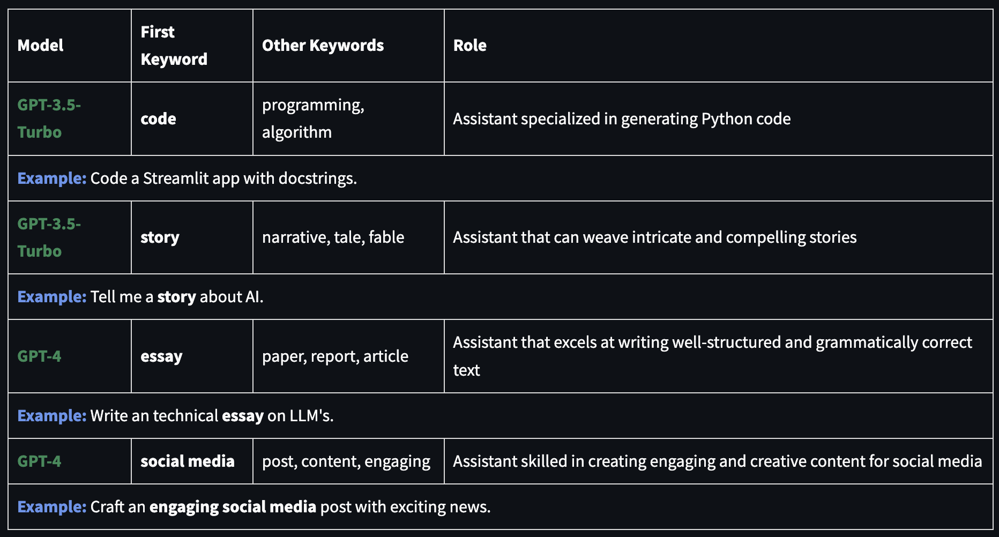
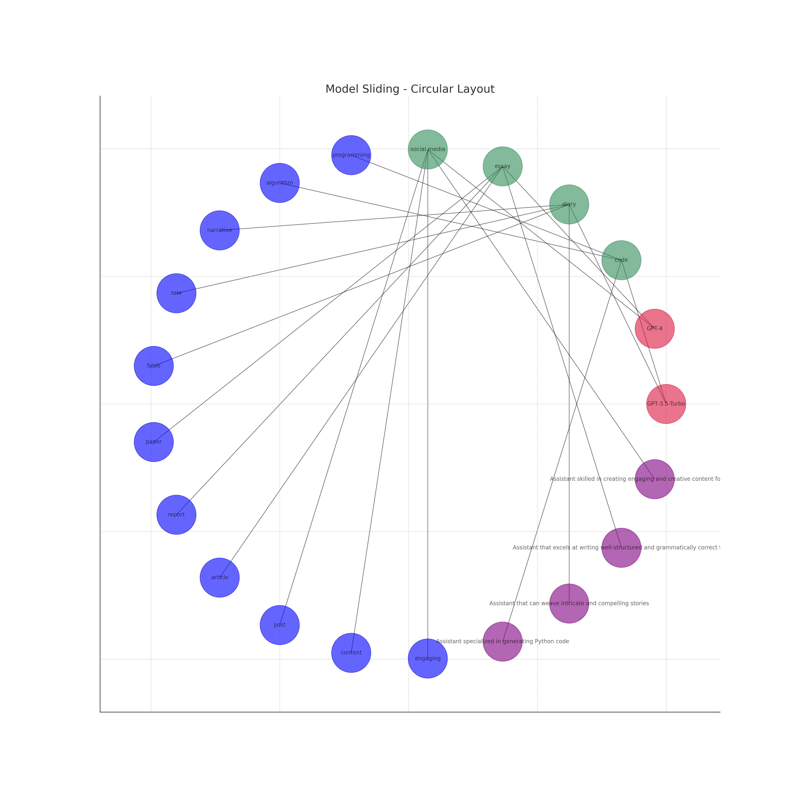
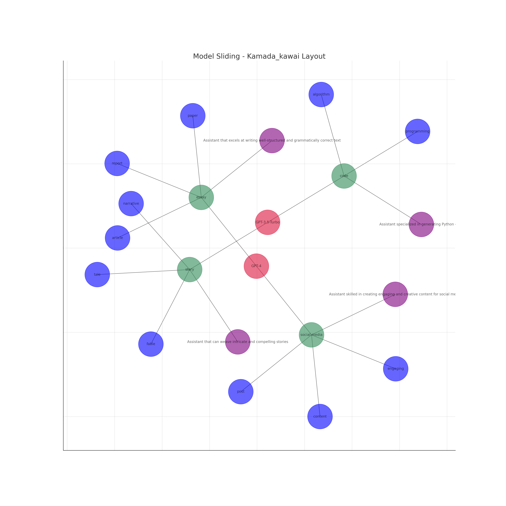
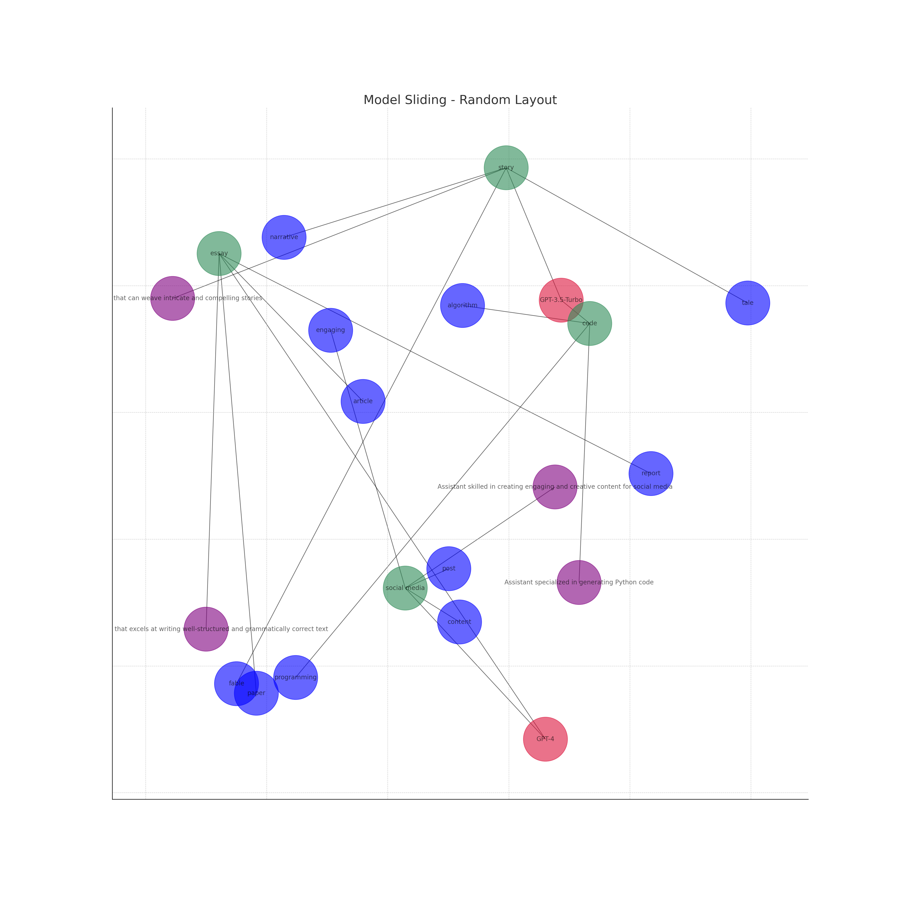
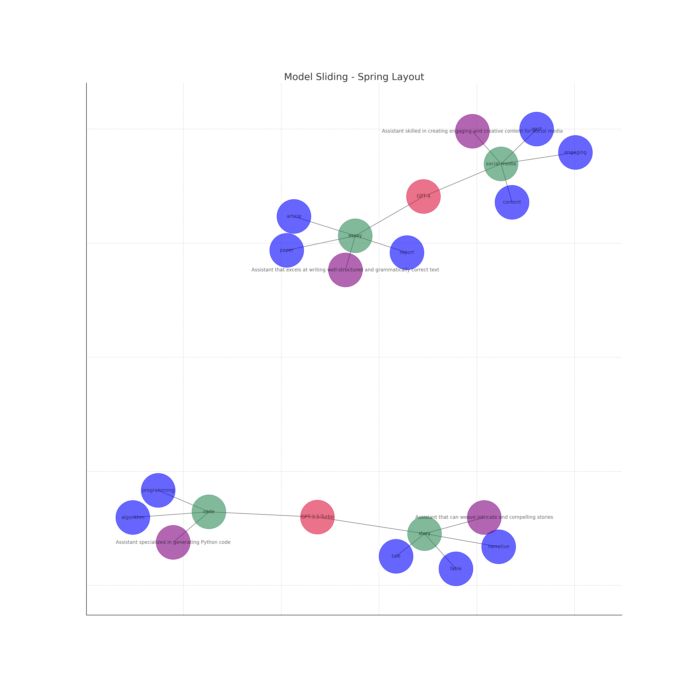
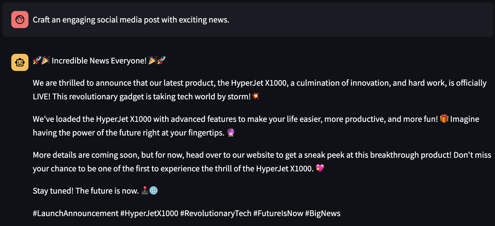
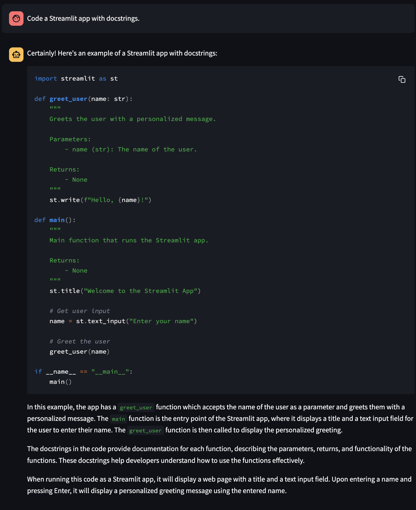
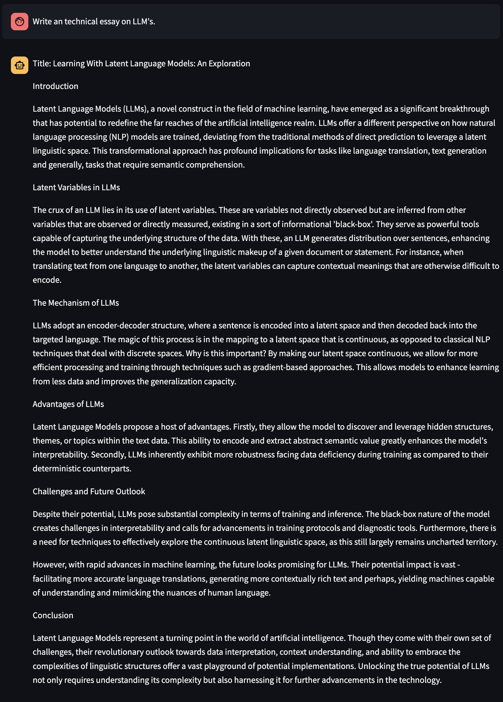

# MetaBot: A Multi-Model AI Chatbot

MetaBot is an advanced AI chatbot that leverages the "model sliding" technique. MetaBot intelligently selects the most suitable OpenAI GPT model based on a given task based on the prompt.

The application uses a logical dictionary of specific keywords associated with each task type to determine the most suitable model. If the prompt doesn't match any specific keywords, the application defaults to a predetermined model as catch-all and will ask the user to rephrase the prompt if unclear.

MetaBot offers an interactive and user-friendly interface. Users can interact with different models by simply typing their prompts or tasks. The assistant and model information dynamically update in response to the chosen model, providing real-time feedback and enhancing user experience.




## Features

- **Dynamic Model Selection**: MetaBot intelligently selects the most suitable AI model for each task. It uses the GZIP compression algorithm to calculate Normalized Compression Distance (NCD) between the user's input and the conversation history, which helps in predicting the most appropriate class for the input and hence the most suitable model. Whether it's a coding-related question or a request for a creative story, MetaBot picks the best model for the job, thanks to GZIP.

- **Interactive User Interface**: Powered by Streamlit, MetaBot provides an interactive chat interface where users can input their prompts and receive responses from the AI.

- **Realistic Typing Effect**: To enhance the chatting experience, MetaBot simulates a realistic typing effect when generating responses.

- **Adaptable Assistant Roles**: Leveraging GZIP for model selection, MetaBot can take on various roles, such as a coding assistant, a storyteller, or a general helper, to provide contextually appropriate responses. This is made possible by measuring the similarity between the user's input and different classes, such as 'code', 'essay', 'story', etc.

- **Customizable Assistant Avatar**: MetaBot's assistant avatar dynamically updates based on the selected model, providing a visual representation of the model in use.

### Use of GZIP

MetaBot uses GZIP as part of its core logic to improve model selection and contextual appropriateness of the assistant roles. The GZIP logic is used to compress the strings of text that form the training data for the MetaBot. This is performed in the `create_compressor` function which takes in a compression method (in this case 'gzip') and returns a corresponding compressor object. The compressor object has a `compress` method that takes a string and returns a compressed string, and a `decompress` method...

The use of GZIP allows the training data to be stored and transferred more efficiently, as the compressed strings take up less space than the original strings. Moreover, it enables the calculation of Normalized Compression Distance (NCD), a measure used to predict the most appropriate class for a user's input, thereby enhancing the chatbot's ability to provide relevant and accurate responses.

```python
import zlib

def create_compressor(compression):
    if compression == 'gzip':
        return zlib.compressobj(9, zlib.DEFLATED, zlib.MAX_WBITS | 16)
    elif compression == 'zlib':
        return zlib.compressobj(9, zlib.DEFLATED, zlib.MAX_WBITS)
    else:
        raise ValueError(f"Unsupported compression method: {compression}")

compressor = create_compressor('gzip')
compressed_data = compressor.compress(training_data)
decompressed_data = compressor.decompress(compressed_data)
```

- **Model Information**: MetaBot displays the model information, including the model name, description, and the number of parameters, to provide users with a better understanding of the model.

- **Fine Tuned Models**: MetaBot is logically ready to use fine-tuned models for use-case specific tasks. For example, a fine-tuned model for language translation can be used for language learning related tasks.


## Meta Model Sliding: A Proof of Concept for Dynamic Model Selection

In an era where artificial intelligence is rapidly advancing, there is an abundance of AI models, each with its unique strengths and specializations. Leveraging these strengths for specific tasks can significantly enhance performance. However, the challenge lies in switching seamlessly between these models, ensuring that each task is handled by the most competent model.

To overcome this challenge, we introduce the concept of "Model Sliding". This proof-of-concept technique demonstrates a novel approach toward logical model selection, capitalizing on the strengths of each model for optimal responses and use of tokens. GZIP plays a crucial role in this process, enhancing the performance and scalability of our chatbot.


## Model Sliding: An Overview

Model Sliding allows for the transition between different AI models based on the task at hand. The underlying principle of this approach is to maximize the potential of each model for specific tasks. 
- GPT-3.5-Turbo could be favored for generating Python code.
- GPT-4 might be the go-to for crafting engaging social media content.

The Meta Model uses a set of keywords to determine which model is best suited for the task. The keywords are associated with specific models and tasks, enabling the Meta Model to "slide" between models as per the requirements of the task.

## Visualizing Model Sliding

To better understand how MetaBot handles a prompt that initiates a task. We have visualized it as a network of nodes, where each node represents a model, task, role, or keyword. The edges connecting these nodes signify the relationships between these elements. The various task dimensions are represented by different colors. A neural network of layers can be seen at the core of the network, representing the models.

The network visualizations below show the Model Sliding network in different layouts. The models (GPT-3.5-Turbo and GPT-4) are at the core, connected to various tasks like 'code', 'story', 'essay', and 'social media'. These tasks are further linked to other keywords and the roles they play.

[](./images/slide1.png)

[](./images/slide2.png)

[](./images/slide3.png)

[](./images/slide4.png)

In these network visualizations, the models (GPT-3.5-Turbo and GPT-4) are at the core, connected to various tasks like 'code', 'story', 'essay', and 'social media'. These tasks are further linked to other keywords and the roles they play.

## Advantages of Model Sliding

Model Sliding offers several benefits:

- **Task-specific Optimization**: By allocating the most appropriate model for each task, Model Sliding enhances performance across a wide array of tasks.
- **Efficient Resource Utilization**: Instead of concurrently operating multiple models, Model Sliding leverages one model at a time, ensuring efficient use of resources.
- **Adaptability**: The system can be effortlessly updated to incorporate new models and tasks as they emerge.
- **Optimal Token Usage**: With the ability to dynamically select models based on the task, Model Sliding ensures optimal use of tokens. This is especially advantageous when multitasking or engaging with large language models (LLMs), as it allows for effective token allocation, leading to enhanced performance and cost efficiency.
---
## Here are the roles that the Assistant will use. Example responses for different assistant roles:
### Meta Model Sliding Assistant Examoples
- Code Assistant



- Storytelling Assistant



- Writing Assistant



- Social Media Assistant


---
# Getting Started

## Prerequisites

- Python 3.10 or later
- OpenAI API key

## Installation

1. Clone the repository:
   ```
   git clone https://github.com/AdieLaine/MetaBot.git
   ```
2. Navigate to the project directory:
   ```
   cd MetaBot
   ```
3. Install the required Python packages:
   ```
   pip install -r requirements.txt
   ```
4. Set your OpenAI API key. You can do this in one of the following ways:
   - Directly in the `metabot.py` file:
     ```
     openai.api_key = "set-your-api-key-here"
     ```
   - Using Streamlit secrets management:
     ```
     echo -n "set-your-api-key-here" > ~/.streamlit/secrets.toml
     ```
   - Or, the application will ask you to enter it if no API key is found.

### Usage

To start the application, run:
```
streamlit run src/metabot.py
```
Then, navigate to `http://localhost:8501` in your web browser.

## License

This project is licensed under the terms of the MIT license. See [LICENSE](LICENSE) for more details.
